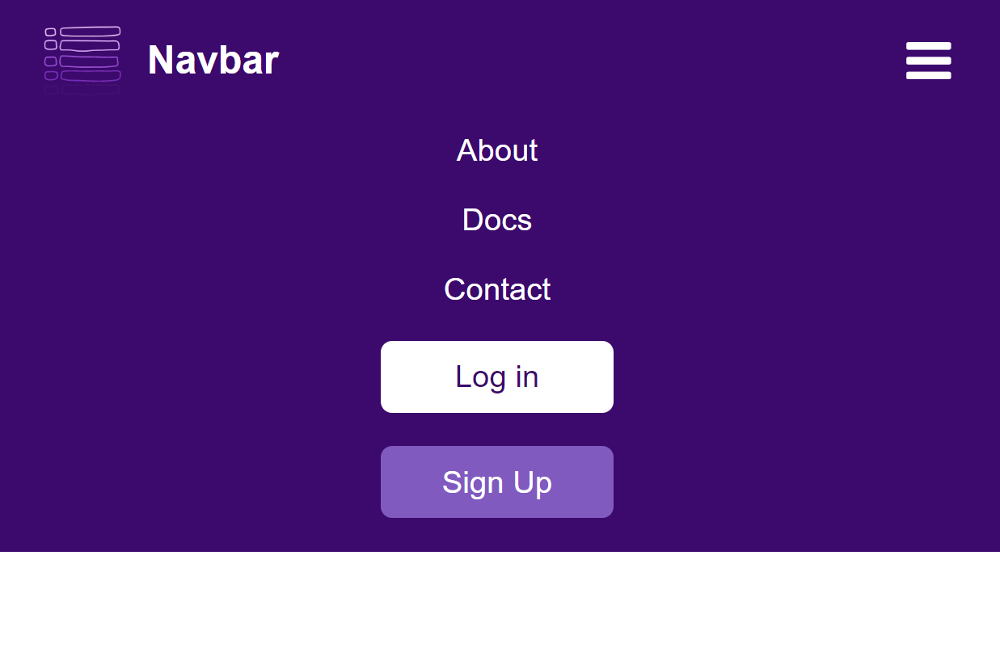

# React Responsive Navbar

Navbars are essential components in many applications and learning how to make one responsive with react had to be on my journey.

## Screenshot

To use this app run these commands:

- ### `npm install`
- ### `npm start`

## Built with

- Semantic HTML5 markup
- CSS custom properties
- Font Awesome
- React.js
- Normalize.css

## Author

- Frontend Mentor - [@AyaZayed](https://www.frontendmentor.io/profile/AyaZayed)
- Linkedin - [Aya Zayed](https://www.linkedin.com/in/aya-zayed-2000/)
